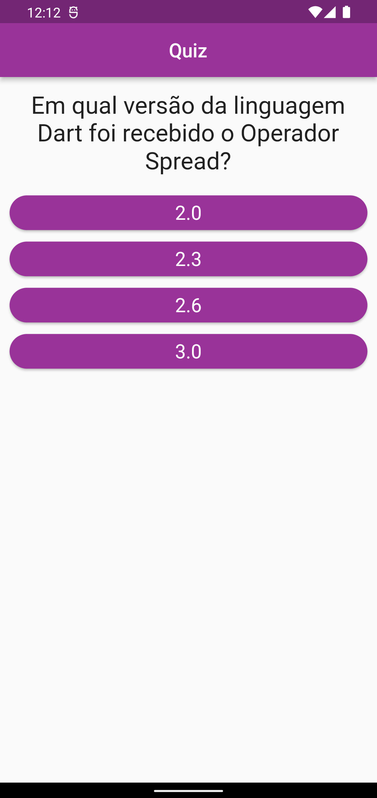

# 
 

## Sobre o projeto

Dart quiz é um joguinho de perguntas e respostas desenvolvido em Flutter sobre a linguagem de programação Dart.

## Layout mobile

## Tecnologias utilizadas

Flutter

## Desenvolvedora

Jusy Lopes
https://www.linkedin.com/in/jusylopes
